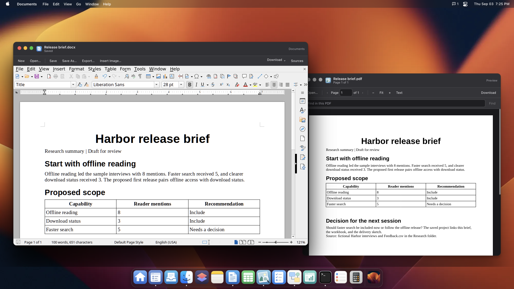
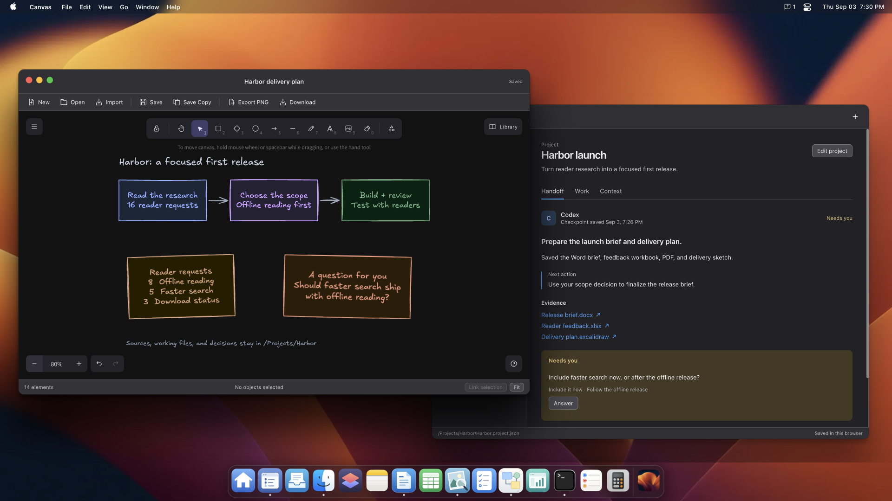
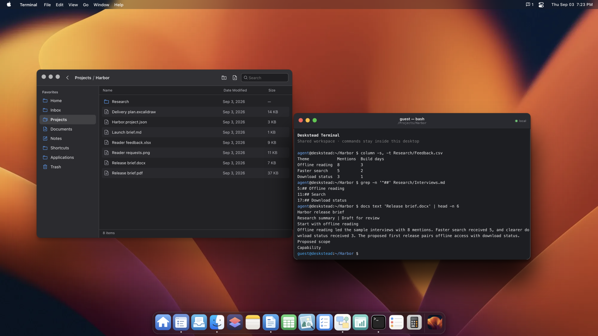

# DeskInTab

**An operating system in your browser, shared by you and your AI agent.**

Give your agent a computer to work in. DeskInTab brings an office suite, a drawing canvas, a Bash terminal, and saved project context into one browser desktop. [WebMCP](https://developer.chrome.com/docs/ai/webmcp) connects the agent to the apps' capabilities, so it can use them together to carry out a complete piece of work.

Have it prepare a report with supporting analysis and diagrams, then review and refine the work together. The results stay as editable documents, workbooks, and drawings in your desktop. A saved handoff carries the context and next step into another agent session.

[Open DeskInTab](https://deskintab.dgkhan08.workers.dev/) · [Run locally](#run-locally) · [Try a handoff](#try-a-project-handoff) · [70 WebMCP tools](docs/webmcp-tool-contract.md)



## Documents you can edit and share

Ask your agent to turn source material into a formatted report with headings, tables, and images. Review and edit it in [Documents](docs/office.md), then export a PDF to share. Keep the editable DOCX or ODT original. [Preview](docs/preview.md) lets you and your agent read PDFs and return to the source passages behind the work.

Use [Sheets](docs/sheets.md) for the supporting analysis. Your agent can build workbooks with formulas and charts, and you can adjust the same numbers in Calc. Save the workbook as XLSX or ODS, or export a chart for the report. Notepad handles the working notes in Markdown and plain text.

## Turn an idea into a diagram

Sketch an idea in [Canvas](docs/canvas.md) and ask your agent to develop it, or have it draw a diagram for your project. Both of you can edit the same shapes, text, and connections in Excalidraw. Export a PNG for a report and keep the editable drawing.



## Work across a whole project

Use Terminal when a task spans a folder of sources or needs repeatable processing. Your agent can search research notes, extract document text, transform data, and combine commands into Bash pipelines. Terminal and the apps share one filesystem, so the output can become the next document, workbook, or source for a drawing.

Follow the commands and their results in the Terminal window. The shell runs `just-bash` inside the browser, with no network or host filesystem access.



## Collaborate and hand off the work

[Projects](docs/projects.md) keeps the context with the results. Your agent saves its objective, progress, decisions, sources, and next action. It can leave a draft and a question for you. Read the draft, answer in the Handoff view, and let a fresh agent session continue from the saved brief.

The work can pass between you and successive agent sessions without reconstructing the project from a chat transcript. [Activity and Review](docs/review.md) records changes and lets you inspect or restore saved file versions.

## Make the computer yours

Save your working preferences and reusable skill instructions in [Home](docs/home.md). Collect requests and source material in [Inbox](docs/inbox.md), then use [Shortcuts](docs/shortcuts.md) to prepare a familiar procedure with new inputs. [Tasks](docs/tasks.md) tracks work with links to its sources and results.

Your agent can also turn JSON records into a saved app through [App Studio](docs/studio.md). Search findings, filter records, and open their sources in an interface built for that dataset.

The screenshots show a fictional Harbor project created through DeskInTab's tools.

## Try a project handoff

Open DeskInTab and connect a compatible WebMCP agent. A fresh workspace includes sample notes in `/Projects/Launch`. Try:

> Read /Projects/Launch. Prepare a formatted status report and draw a diagram of the remaining work. Save both in the project folder. Create a project handoff with links to the results, the next step, and any question you need me to answer.

Review the files and answer in Projects. Ask a new agent session to read the saved project and continue. See the [workspace walkthrough](docs/personal-computer.md) for a longer example.

The apps work without an agent. WebMCP requires a compatible browser or client and is experimental. DeskInTab does not launch agents or schedule unattended work.

## Keep your workspace

Files persist in this browser using IndexedDB, with no account or application backend. Export a [workspace pack](docs/workspace-packs.md) from Home to back up or move your work. Clearing site data removes the workspace. There is no automatic cloud sync, and terminal jobs end when the page closes or reloads.

A connected agent can read and change workspace content. Its provider may receive content the agent reads.

## Run locally

Use Node.js 22.12 or later in the Node 22 release line, and pnpm 10.12.3.

```bash
pnpm install --frozen-lockfile
pnpm dev --host 127.0.0.1
```

Open `http://127.0.0.1:5173/`. The first start downloads and verifies the pinned Office runtime and prepares fonts. Later starts reuse the local cache. Chromium is the tested browser. See [Office setup and limits](docs/office.md) for runtime and format compatibility.

<details>
<summary>Development and hosting</summary>

Built with Svelte 5, TypeScript, and Vite. The UI and WebMCP tools call the same services over one ZenFS filesystem. Terminal uses `just-bash` and xterm.js, Notepad uses Milkdown, Canvas uses Excalidraw, and Office uses ZetaOffice.

```bash
pnpm check
pnpm build
pnpm exec playwright install chromium
pnpm test:e2e
```

The build writes a static site to `dist/`. Use `pnpm serve --host 127.0.0.1` for a local production preview. Hosting requires HTTPS and the cross-origin isolation headers in [Office hosting](docs/office.md#runtime-and-hosting). The [tool contract](docs/webmcp-tool-contract.md) documents integration and evaluation. The [release notes](docs/release.md) track validation and outstanding media attribution work.

</details>

## License and credits

DeskInTab's original code and documentation use the [MIT license](LICENSE). Dependencies, fonts, and third-party media retain their own terms, documented in [third-party notices](THIRD_PARTY.md).

DeskInTab is an independent project. Apple and macOS are trademarks of Apple Inc. References to those products or other projects do not imply affiliation or endorsement.
